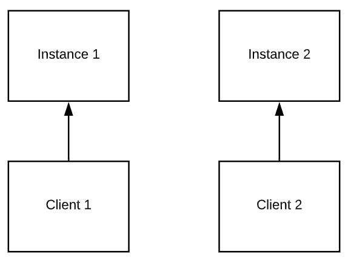

# [WIP] Communicating between Azure App Service scale out instances

When you're running an App Service on a scale out App Service Plan, many instances of your application may be running at any time. Applications designed for this architecture are supposed to be completely stateless. This however poses some restrictions that are not ideal.

This document outlines a proposal to facilitate real time bi-directional communication between any number of App Service instances with minimal external dependencies.

## Introduction

App Services in themselves do not facilitate communication between instances. This complicates some types of applications, e.g. chat. Let's say you have two browsers connected into an App Service application and you want to allow them to chat to each other. With multiple App Service instances, you'll quickly get into a situation like the following:

The problem here is that there's no way to get chat messages from Client 1 to Client 2. This document describes an architecture in which this would be possible.

## High level

At a high level, the proposal describes a way to allow App Services to communicate with each other over web sockets using very limited synchronization.

The challenge to get inter App Service communication to work is not being able to access an App Service. This is possible through the public URL. The problem however is that it's not possible to reach a specific instance.

The idea is to abuse affinity cookies to work around this. This works roughly as follows:

* When an App Service comes online, it connects to a public Web Socket endpoint;
* When this connection is made, Azure will set an affinity cookie. This cookie allows us to open new connections to that same instance;
* The value of this affinity cookie is then stored in persistent storage, e.g. an SQL database or Azure Tables. This is the only persistent storage required to implement this architecture;
* When the next App Service instance comes online, it looks up the current affinity cookie and then uses that to find the same App Service instance the first one connected to.

When the first App Service comes online, we're pretty much guaranteed that it'll connect back into itself. The affinity cookie will identify that first App Service instance. All App Service instances that come online after that will connect into that same App Service instance.

Using this mechanism, we can ensure that all App Service instances have a connection open into a single App Service instance. This can be used to allow them to communicate with each other.

The remainder of this document describes the full protocol. The above gives us a basis we can work with. There are however quite a few catches we need to take care of. E.g. if the first App Service goes offline because the App Service Plan is scaled down, all App Services need to reconnect into a different App Service. This needs to be done in a way that we're sure that they all connect into the same new App Service.